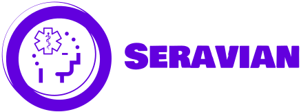
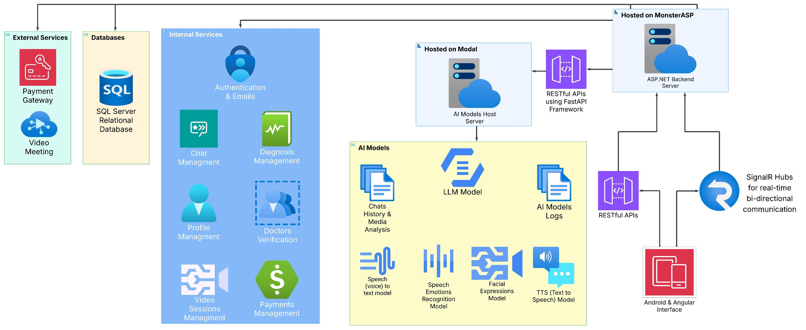

  <picture>
    <source media="(max-width: 768px)" srcset="./.assets/seravian_logo.png" width="300">
    
  </picture>

---

## 🧠 About Seravian

**Seravian** is an innovative AI-powered mental health support platform developed as a **Graduation Project** by Computer Science students (2024–2025). Our mission is to make mental health support accessible, intelligent, and personalized through cutting-edge artificial intelligence and modern technology.

The platform combines advanced natural language processing, emotion recognition and speech analysis to provide comprehensive mental health assessments and real-time emotional support.

---

## 🏗️ Platform Architecture

  <picture>
    <source media="(max-width: 768px)" srcset="./.assets/seravian_block_diagram.jpeg" width="100%">
    
  </picture>

Our platform consists of four main components working together to deliver seamless mental health support:

- **🖥️ Web Application** - Angular-based admin dashboard and web interface
- **📱 Mobile Application** - Kotlin Android app for end-users
- **⚙️ Backend API** - ASP.NET Core Web API serving as secure middleware
- **🤖 AI Services** - Python FastAPI microservices hosted on Modal

---

## 🚀 Key Features

### 🤖 **AI-Powered Mental Health Support**

- Advanced conversational AI using MentalLlama models (7B & 13B)
- Real-time emotional analysis and personalized responses
- Comprehensive mental health diagnostics and assessments

### 🎤 **Multi-Modal Interaction**

- **Speech-to-Text (STT)** - Natural voice conversations
- **Text-to-Speech (TTS)** - AI responses delivered through Tortoise TTS model

### 📊 **Comprehensive Analytics**

- Detailed diagnostic reports and recommendations
- Progress monitoring and mental health insights
- Historical data analysis for treatment optimization

---

## 🛠️ Technology Stack

### Frontend Technologies

- **Web:** Angular, TypeScript, Material Design
- **Mobile:** Kotlin, Jetpack Compose, Material 3

### Backend Technologies

- **API:** ASP.NET Core (.NET 9), C#
- **Database:** SQL Server with Entity Framework Core
- **Authentication:** JWT + Email OTP via MailKit

### AI & Machine Learning

- **Language Models:** MentalLlama 7B & 13B models
- **Speech Processing:** Tortoise TTS model
- **Hosting:** Modal cloud platform with FastAPI

### Infrastructure

- **Hosting:** MonsterASP (Windows hosting)
- **Media Processing:** FFmpeg for audio/video handling
- **Real-time Communication:** SignalR for live chat

---

## 📂 Repositories

| Repository | Description | Technology | Developers |
|------------|-------------|------------|------------|
| [**Seravian-Web**](https://github.com/Seravian/Seravian-Web) | Angular web application and admin dashboard | Angular, TypeScript | [Abdalrhman Alhrery](https://github.com/alhrery2003), [Khalid Mohamed](https://github.com/Khalidsaied) |
| [**Seravian-Backend**](https://github.com/Seravian/Seravian-Backend) | ASP.NET Core Web API backend | C#, ASP.NET 9 | [Mohamed Saeed](https://github.com/mohamedsaeed138) |
| [**Seravian-App**](https://github.com/Seravian/Seravian-App) | Android mobile application | Kotlin, Jetpack Compose | [Hossam Walid](https://github.com/GreenVenom77), [Kareem Essam](https://github.com/Kessam10) |
| [**Seravian-AI**](https://github.com/Seravian/Seravian-AI) | AI microservices and machine learning models | Python, FastAPI | [Ahmed Gharieb](https://github.com/MeloR1), [Mohamed Saeed](https://github.com/mohamedsaeed138) |

---

## 📋 Getting Started

### For Users

1. **📱 Download the Seravian mobile app** from [our download page](https://drive.google.com/file/d/18n3C9lD8GJzN6lh3_dZK2tZfMzSXafEV/view?usp=sharing)
2. **🌐 Access the web platform** at [seravian.netlify.app](https://seravian.netlify.app/)
3. **📝 Create an account** using email verification
4. **🧠 Start your mental health journey** with AI-powered support

### For Developers

Each repository contains detailed setup instructions:

1. **Clone the desired repository**
2. **Follow the README instructions** for prerequisites and configuration
3. **Set up the development environment** according to the tech stack
4. **Configure API keys and environment variables**
5. **Run the application locally** for testing and development

---

## 🔐 Privacy & Data Protection

At Seravian, we take your privacy and mental health data seriously. Our platform is built with security-first principles.

**<a href="./.assets/seravian_privacy_policy.pdf" target="_blank">📄 Read our Privacy Policy</a>** - Comprehensive information about how we collect, use, and protect your data.

---

## 🌟 Impact & Vision

### Our Mission

To democratize mental health support through accessible, intelligent, and personalized AI technology, breaking down barriers to mental healthcare worldwide.

### Target Impact

- **🌍 Global Accessibility** - Reach underserved communities lacking mental health resources
- **💰 Cost-Effective Care** - Reduce the financial burden of mental health support
- **⏰ 24/7 Availability** - Provide immediate support when traditional services aren't available
- **📊 Data-Driven Insights** - Enable better understanding of mental health patterns and treatments

---

## 📚 Project Documentation

For comprehensive technical documentation, system architecture details, and development guidelines, please refer to our complete project documentation.

**<a href="./.assets/seravian_project_documentation.pdf" target="_blank">📖 View Complete Project Documentation</a>** - Detailed technical specifications, API documentation, and development guide.

---

  <h3>🧠 Built with ❤️ for Mental Health Awareness and Support</h3>
  
<em>"Technology should serve humanity's most fundamental needs - and mental health is one of them."</em>

---

**© 2024-2025 Seravian Organization. All rights reserved.**
